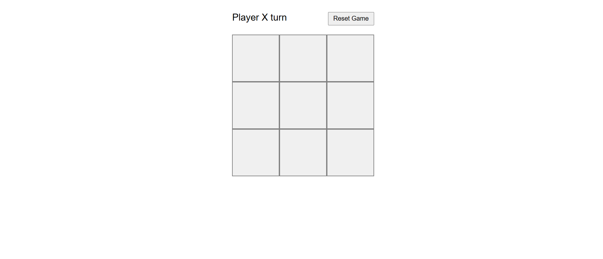
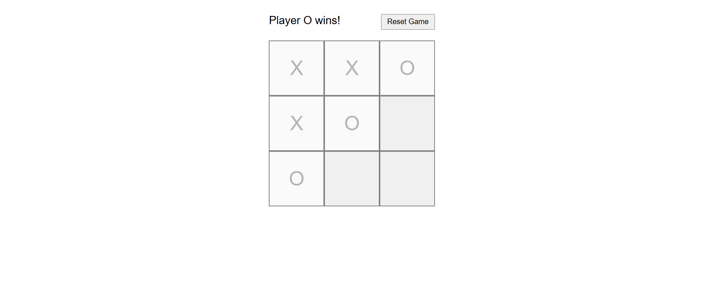

      # Tic-Tac-Toe Game (React)

## 🎮 Overview
This is a simple **Tic-Tac-Toe** game built using **React.js**. It allows two players to take turns and play the classic game, with real-time updates and automatic win detection.

## 🚀 Features
- Interactive **Tic-Tac-Toe** board
- Real-time player turn updates
- Win and draw detection
- Reset game functionality
- Fully responsive UI

## 🛠️ Technologies Used
- **React.js** (Functional Components & Hooks)
- **CSS** for styling

## 📂 Project Setup
Follow these steps to run the project locally:

### 1️⃣ Clone the Repository
```bash
git clone https://github.com/Goutam990/Tic-Tac-Toe-Game---React.git
cd Tic-Tac-Toe-Game---React
```

### 2️⃣ Install Dependencies
```bash
npm install
```

### 3️⃣ Run the Development Server
```bash
npm start
```
The app will be available at **http://localhost:3000/**.

## 📸 Screenshots
### Game UI


### Game Play


## 📌 How to Play?
1. Two players take turns clicking on a square.
2. **X** always plays first.
3. The first player to get **three in a row (horizontal, vertical, or diagonal)** wins!
4. If all squares are filled and no player wins, the game ends in a **draw**.
5. Click the **Reset** button to start a new game.

## 🚀 Deployment
The project is deployed on **Vercel**:
🔗 [Live Demo](https://tic-tac-toe-game-react-qxnd.vercel.app/)

## 👨‍💻 Author
Developed by **Goutam Tiwari**

---
⭐ Feel free to fork and contribute! 😊
